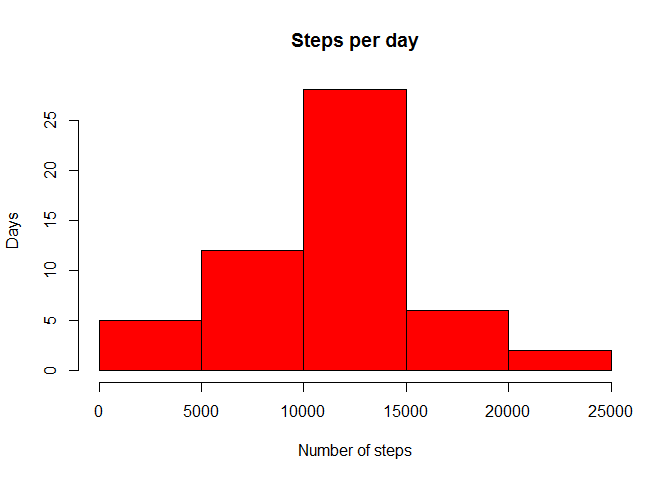
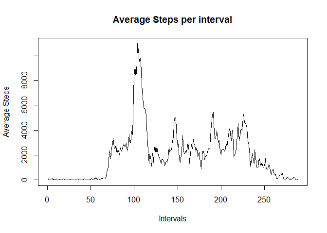
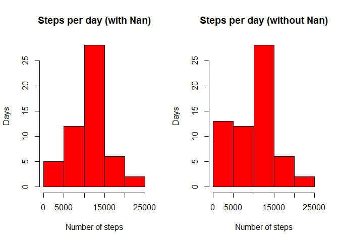
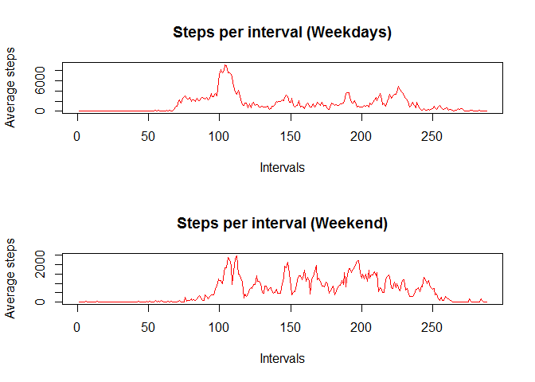

Loading and preprocessing the data
==================================

Let's first load the data:

    df<-read.csv("activity.csv")

    df$newDate <- as.Date(df$date, format="%d/%m/%Y")

Question: What is mean total number of steps taken per day?
===========================================================

Histogram of the total number of steps taken each day

    #Subset and sum by year
    stepsDay<-with(df,tapply(df$steps, df$date, sum))

    hist(stepsDay,
         xlab="Number of steps",
         col="red",
         main = "Steps per day",
         ylab = "Days"
         )

Mean of the total number of steps taken per day

    # can only consider non nan values
    mean(stepsDay,na.rm=TRUE)

    ## [1] 10766.19

Median of the total number of steps taken per day

    # can only consider non nan values
    median(stepsDay,na.rm=TRUE)

    ## [1] 10765

Question: What is the average daily activity pattern?
=====================================================

Next a time series plot is presented of the 5-minute interval (x-axis)
and the average number of steps taken, averaged across all days (y-axis)

    stepsInterval<-with(df,tapply(df$steps, df$interval, sum,na.rm=TRUE))
    plot(stepsInterval,type="l",xlab="Intervals", ylab="Average Steps", main = "Average Steps per interval")

Here I identify the 5-minute interval, on average across all the days in
the dataset, contains the maximum number of steps

    as.numeric(names(stepsInterval[which.max(stepsInterval)]))

    ## [1] 835

Imputing missing values
=======================

Total number of missing values in the dataset (i.e. the total number of
rows with NAs):

    sum(is.na(df$steps))

    ## [1] 2304

For filling missing data I will define the missing values as the median
for the interval. To do so I will define a function that for a given
steps value checks if it is "na"" and if it is will look on a table for
the corresponding median

    MedianStepsInterval<-with(df,tapply(df$steps, df$interval, median,na.rm=TRUE))

    repfunc <- function(steps, interval ){
        if(is.na(steps))
        {
            med <- MedianStepsInterval[names(MedianStepsInterval) == interval]
        }
        else
        {
            med <- steps
        }
        return(med)
    }

Create a new dataframe and replace the "na" step values by the median

    newdf <- df
    newdf$steps<-mapply(repfunc, df$steps, df$interval)

New histogram of the total number of steps taken each day

    #Subset and sum by year
    stepsDayn<-with(df,tapply(df$steps, df$date, sum))
    par(mfrow=c(1,2))
    hist(stepsDay,
         xlab="Number of steps",
         col="red",
         main = "Steps per day (with Nan)",
         ylab = "Days"
         )
    stepsDaywn<-with(df,tapply(newdf$steps, newdf$date, sum))
    hist(stepsDaywn,
         xlab="Number of steps",
         col="red",
         main = "Steps per day (without Nan)",
         ylab = "Days"
         )

Mean and Median of the total number of steps taken per day

    library(xtable)
    #Steps day with nans replaced
    stepsDaywn<-with(newdf,tapply(newdf$steps, newdf$date, sum))
    a <- mean(stepsDaywn,na.rm=TRUE)
    b <- median(stepsDaywn,na.rm=TRUE)

    #Steps day with nans
    stepsDayn<-with(df,tapply(df$steps, df$date, sum))
    c <- mean(stepsDayn,na.rm=TRUE)
    d <- median(stepsDayn,na.rm=TRUE)

    msdf <-data.frame(row.names = c("without nans","with nans"),mean = c(a,c),median = c(b,d))
    print(xtable(msdf), type="html")

<!-- html table generated in R 3.4.0 by xtable 1.8-2 package -->
<!-- Fri Jun 09 15:04:55 2017 -->
<table border="1">
<tr>
<th>
</th>
<th>
mean
</th>
<th>
median
</th>
</tr>
<tr>
<td align="right">
without nans
</td>
<td align="right">
9503.87
</td>
<td align="right">
10395
</td>
</tr>
<tr>
<td align="right">
with nans
</td>
<td align="right">
10766.19
</td>
<td align="right">
10765
</td>
</tr>
</table>
The major impact of imputing the missing data is a clear increase in the
number of days with few steps per day, which are often disregarded when
the the nan are ignored.

As for mean and median values, they both increase but the mean value is
clearly the most affected.

Question: Are there differences in activity patterns between weekdays and weekends?
===================================================================================

First we add a new factor variable identifying the weekdays

    weekdays <- weekdays(as.Date(newdf$date, format="%Y-%m-%d"))

    weekdays[weekdays=="sábado" | weekdays=="domingo"]<-"weekend"
    weekdays[weekdays!="weekend"]<-"weekday"

    newdf$weekdays <- as.factor(weekdays)

Now I make a panel plot containing the time series plot.

    stepsDays<-with(newdf,tapply(steps, list(interval,weekdays), sum))

    par(mfrow=c(2,1))
    plot(stepsDays[,1],
         type = "l",
         xlab="Intervals",
         col="red",
         main = "Steps per interval (Weekdays)",
         ylab = "Average steps"
         )
    plot(stepsDays[,2],
         type = "l",
         xlab="Intervals",
         col="red",
         main = "Steps per interval (Weekend)",
         ylab = "Average steps"
         )

